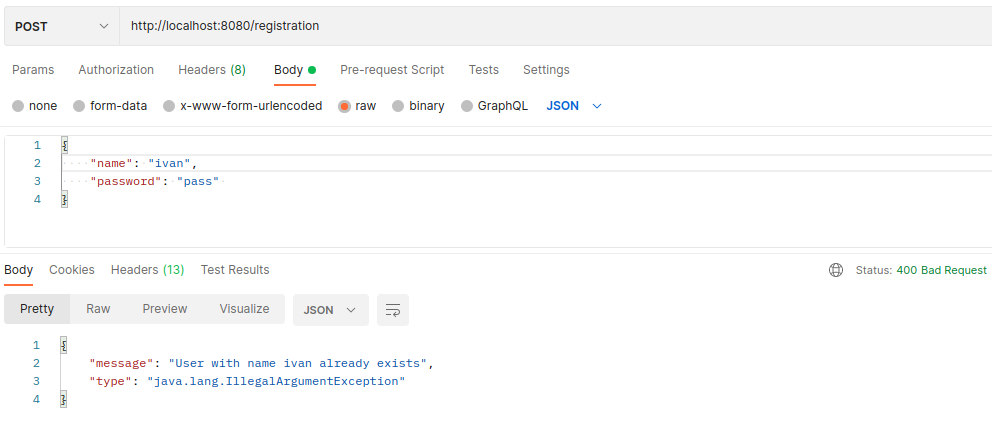

# Сервер сообщений на RESP API

Эндпойнты

При POST-запросе на http://localhost:8080/registration с JSON вида  
{  
&nbsp;&nbsp;&nbsp;&nbsp; "name": "ivan",  
&nbsp;&nbsp;&nbsp;&nbsp; "password": "pass"  
}  
происходит регистрация пользователя  

При POST-запросе на http://localhost:8080/login с JSON вида    
{  
&nbsp;&nbsp;&nbsp;&nbsp; "name": "ivan",  
&nbsp;&nbsp;&nbsp;&nbsp; "password": "pass"  
}  
происходит аутентификация пользователя.  
В ответ сервер присылает JSON с токеном, используя который происходит дальнейшее общение с сервером.  
Токен нужно добавлять в заголовок Authorization для всех последующих запросов.  
Через токен происходит авторизация.  

При POST-запросе на http://localhost:8080/messages с JSON вида  
{  
&nbsp;&nbsp;&nbsp;&nbsp; "name" : "john",  
&nbsp;&nbsp;&nbsp;&nbsp; "message" : "hello"  
}  
сервер сохраняет сообщение пользователя.  
Имя пользователя должно совпадать с именем авторизированного пользователя.  

При POST-запросе на http://localhost:8080/messages с JSON вида  
{  
&nbsp;&nbsp;&nbsp;&nbsp; "name" : "john",  
&nbsp;&nbsp;&nbsp;&nbsp; "message" : "history 10"  
}  
сервер возвращает последние 10 сообщений пользователя.  
Имя пользователя должно совпадать с именем авторизированного пользователя.  

Запуск проекта

1. git clone git@github.com:IvanBelyaev/message.git
2. cd ./message/
3. mvn clean package
4. docker-compose up --force-recreate

Интерфейс проекта

